# Session Middleware Flow Diagram

## Complete Session Middleware Logic

---

## 🔄 Main Flow Diagram

```mermaid
flowchart TD
    Start([Incoming HTTP Request]) --> ParseCookies[Parse Cookies from Request]

    ParseCookies --> CheckSession{Session Cookie<br/>Exists?}

    %% Path 1: Existing Session Cookie
    CheckSession -->|Yes| ExtractSessionId[Extract session_id from Cookie]
    ExtractSessionId --> RedisLookup[🔍 Redis Lookup<br/>GET session:session_id]

    RedisLookup --> RedisFound{Found in<br/>Redis?}

    RedisFound -->|Yes - Cache Hit| ValidSession[✅ Valid Active Session]
    ValidSession --> ExtendTTL[Extend Redis TTL<br/>30 more minutes]
    ExtendTTL --> UpdateLastSeen[Update lastSeenAt<br/>in MongoDB async]
    UpdateLastSeen --> AttachSession

    RedisFound -->|No - Cache Miss| MongoLookup[🔍 MongoDB Lookup<br/>Find by sessionId]

    MongoLookup --> MongoFound{Found in<br/>MongoDB?}

    MongoFound -->|Yes - Expired Session| RecacheSession[Re-cache in Redis<br/>TTL: 30 min]
    RecacheSession --> AttachSession

    MongoFound -->|No - Invalid Session| CreateNew

    %% Path 2: No Session Cookie
    CheckSession -->|No| CheckVisitor{visitor_id Cookie<br/>Exists?}

    CheckVisitor -->|Yes| UseVisitorId[Use Existing visitor_id]
    CheckVisitor -->|No| GenerateVisitorId[Generate New visitor_id<br/>UUID v4]

    UseVisitorId --> CreateNew
    GenerateVisitorId --> CreateNew

    %% Create New Session
    CreateNew[📝 Create New Session]
    CreateNew --> GenerateSessionId[Generate session_id<br/>UUID v4]
    GenerateSessionId --> ParseMetadata[Parse Request Metadata]

    ParseMetadata --> MetadataList[Collect:<br/>• IP Address<br/>• User Agent<br/>• Landing Page<br/>• Referrer<br/>• UTM Params]

    MetadataList --> ParseUA[Parse User Agent]
    ParseUA --> DeviceInfo[Extract:<br/>• Device type<br/>• Browser<br/>• OS]

    DeviceInfo --> CreateMongo[💾 Create in MongoDB]
    CreateMongo --> CreateRedis[💾 Cache in Redis<br/>TTL: 30 min]
    CreateRedis --> SetCookies[Set Response Cookies]

    SetCookies --> SessionCookie["🍪 Set-Cookie: session<br/>HttpOnly, Secure, SameSite=Lax<br/>Max-Age: 1800 (30 min)"]
    SessionCookie --> VisitorCookie["🍪 Set-Cookie: visitor_id<br/>Max-Age: 31536000 (1 year)"]

    VisitorCookie --> AttachSession

    %% Attach Session to Request
    AttachSession[Attach Session to req.session]
    AttachSession --> TrackPageView[Track page_view Event<br/>Async, Non-blocking]

    TrackPageView --> IncrementViews[Increment pageViews Counter]
    IncrementViews --> NextMiddleware[Call next Middleware]

    NextMiddleware --> End([Continue to Controller])

    %% Error Handling
    RedisLookup -.->|Error| ErrorHandler[Log Error]
    MongoLookup -.->|Error| ErrorHandler
    CreateMongo -.->|Error| ErrorHandler

    ErrorHandler --> ContinueWithoutSession[Continue Without Session<br/>Don't Block Request]
    ContinueWithoutSession --> NextMiddleware

    %% Styling
    classDef redisStyle fill:#ff6b6b,stroke:#c92a2a,stroke-width:2px,color:#fff
    classDef mongoStyle fill:#4ecdc4,stroke:#0a9396,stroke-width:2px,color:#fff
    classDef cookieStyle fill:#ffd93d,stroke:#f5a623,stroke-width:2px,color:#333
    classDef successStyle fill:#51cf66,stroke:#2f9e44,stroke-width:2px,color:#fff
    classDef decisionStyle fill:#a78bfa,stroke:#7c3aed,stroke-width:2px,color:#fff
    classDef errorStyle fill:#ff8787,stroke:#e03131,stroke-width:2px,color:#fff

    class RedisLookup,ExtendTTL,CreateRedis redisStyle
    class MongoLookup,CreateMongo,UpdateLastSeen mongoStyle
    class SessionCookie,VisitorCookie,SetCookies cookieStyle
    class ValidSession,AttachSession,NextMiddleware successStyle
    class CheckSession,RedisFound,MongoFound,CheckVisitor decisionStyle
    class ErrorHandler,ContinueWithoutSession errorStyle
```

---

## 🔀 Session State Transitions

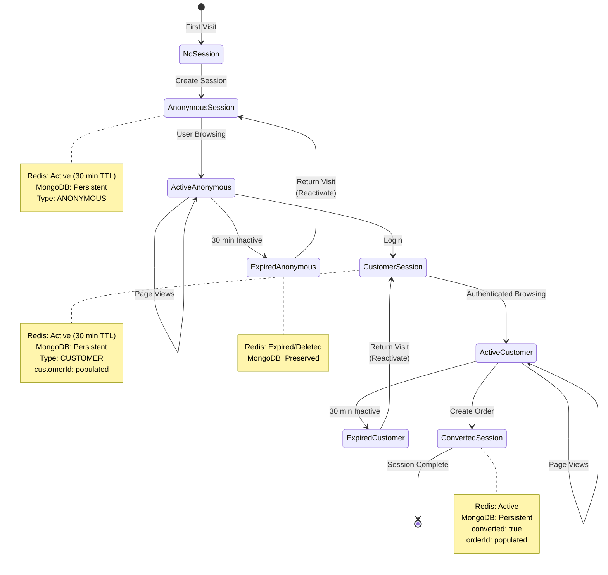

---

## 🗂️ Data Storage Layers

```mermaid
flowchart LR
    subgraph Client["🌐 Client (Browser)"]
        C1[🍪 Cookie: session<br/>Short-lived: 30 min]
        C2[🍪 Cookie: visitor_id<br/>Long-lived: 1 year]
    end

    subgraph Middleware["⚙️ Express Middleware"]
        M1[Parse Cookies]
        M2[Validate Session]
        M3[Attach to req.session]
    end

    subgraph Redis["⚡ Redis Cache<br/>(Hot Data)"]
        R1[session:abc123<br/>TTL: 30 min]
        R2[Active Sessions Only]
        R3[Fast Lookup: ~5ms]
    end

    subgraph MongoDB["💾 MongoDB<br/>(Persistent Storage)"]
        Mongo1[(sessions collection)]
        Mongo2[(session_events collection)]
        Mongo3[(daily_metrics collection)]
    end

    Client --> Middleware
    Middleware --> Redis
    Middleware --> MongoDB
    Redis -.->|Cache Miss| MongoDB
    MongoDB -.->|Recache| Redis

    style Client fill:#e3f2fd,stroke:#1976d2,stroke-width:2px
    style Middleware fill:#fff3e0,stroke:#f57c00,stroke-width:2px
    style Redis fill:#ffebee,stroke:#c62828,stroke-width:2px
    style MongoDB fill:#e8f5e9,stroke:#2e7d32,stroke-width:2px
```

---

## 🔄 Request Lifecycle with Session

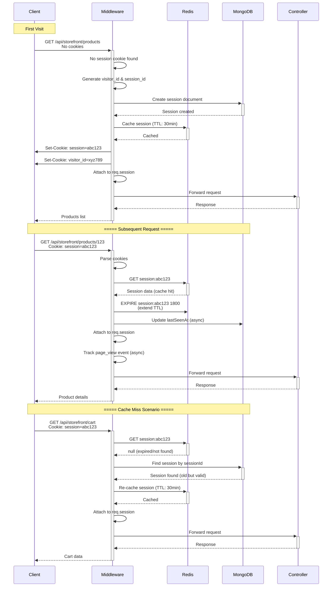

---

## 🎯 Event Tracking Flow

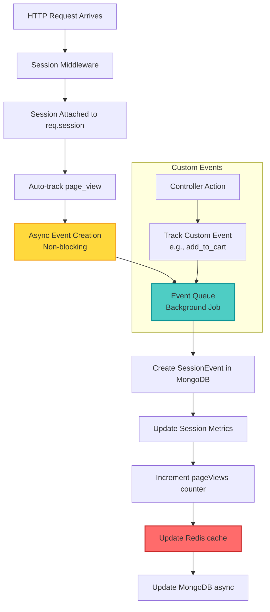

---

## 🔐 Cookie Security Flow

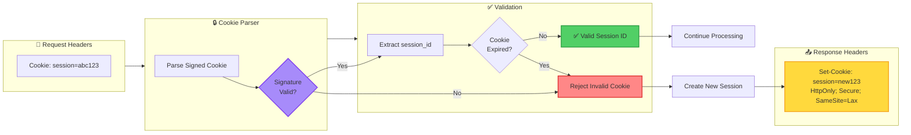

---

## 📊 Session Analytics Pipeline

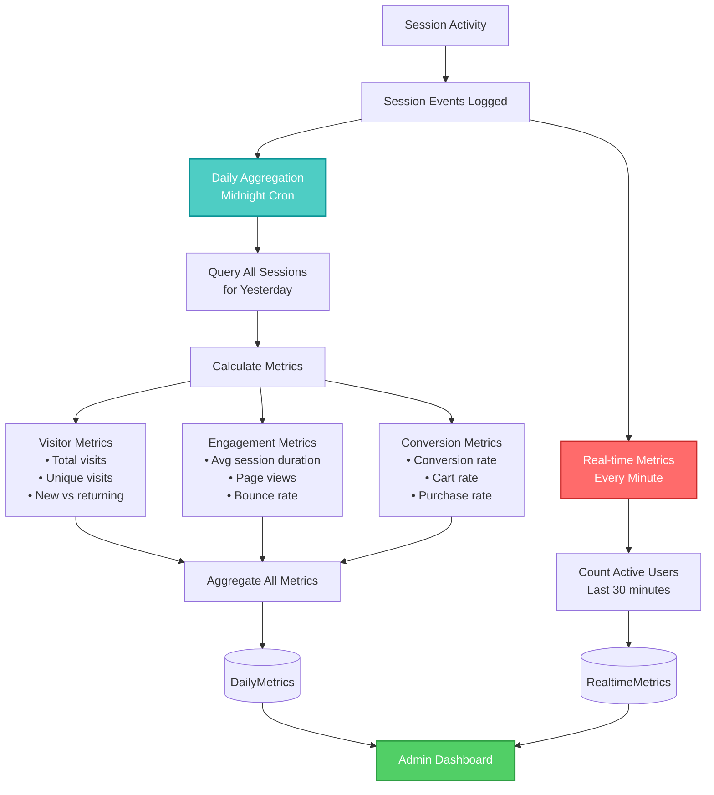

---

## 🚦 Error Handling Flow

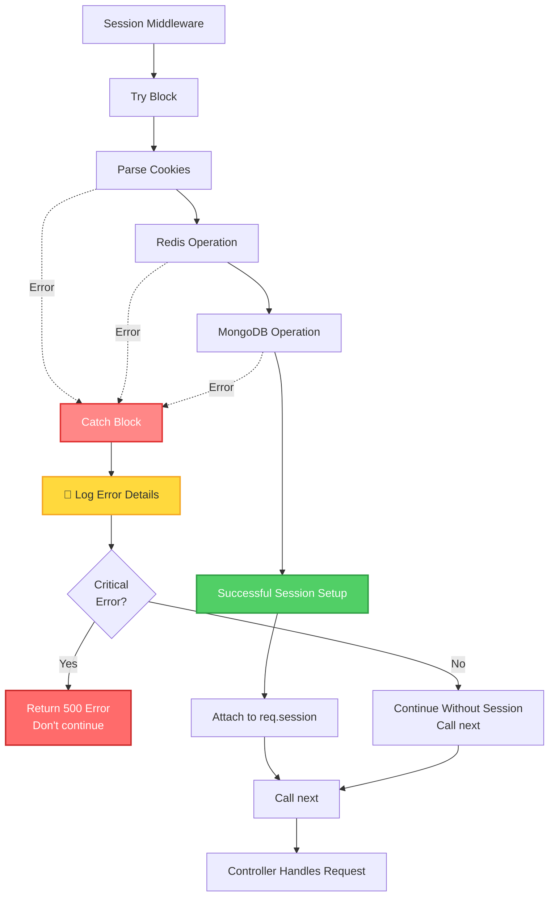

---

## 🔄 Session Conversion (Login) Flow

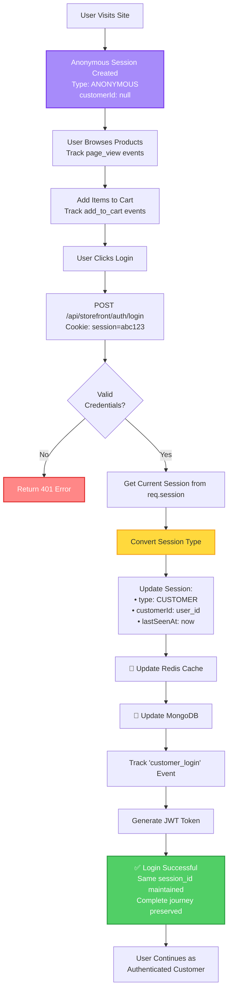

---

## 💰 Order Conversion Flow

```mermaid
flowchart TD
    CustomerSession[Customer Session Active<br/>Type: CUSTOMER<br/>converted: false] --> AddItems[Add Items to Cart]

    AddItems --> Checkout[Proceed to Checkout<br/>Track checkout_started event]

    Checkout --> CreateOrder[POST /api/storefront/orders<br/>Cookie: session=abc123]

    CreateOrder --> OrderService[Order Service]

    OrderService --> CreateOrderDB[Create Order in MongoDB]

    CreateOrderDB --> GetSession[Get Session from req.session]

    GetSession --> MarkConverted[Mark Session as Converted]

    MarkConverted --> UpdateSession[Update Session:<br/>• converted: true<br/>• orderId: order_123<br/>• lastSeenAt: now]

    UpdateSession --> UpdateRedis[💾 Update Redis]
    UpdateRedis --> UpdateMongo[💾 Update MongoDB]

    UpdateMongo --> TrackEvent[Track 'order_completed' Event]

    TrackEvent --> UpdateCustomer[Update Customer Analytics:<br/>• totalOrders++<br/>• totalSpent += amount<br/>• lastOrderDate = now]

    UpdateCustomer --> UpdateProduct[Update Product Analytics:<br/>• totalSales++<br/>• totalRevenue += price]

    UpdateProduct --> Success[✅ Order Created Successfully<br/>Session conversion tracked]

    Success --> Analytics[Session Journey Complete:<br/>visit → browse → login → cart → order]

    style CustomerSession fill:#a78bfa,stroke:#7c3aed,stroke-width:2px,color:#fff
    style MarkConverted fill:#ffd93d,stroke:#f5a623,stroke-width:2px
    style Success fill:#51cf66,stroke:#2f9e44,stroke-width:2px,color:#fff
    style Analytics fill:#4ecdc4,stroke:#0a9396,stroke-width:2px,color:#fff
```

---

## 📱 Multi-Device Session Tracking

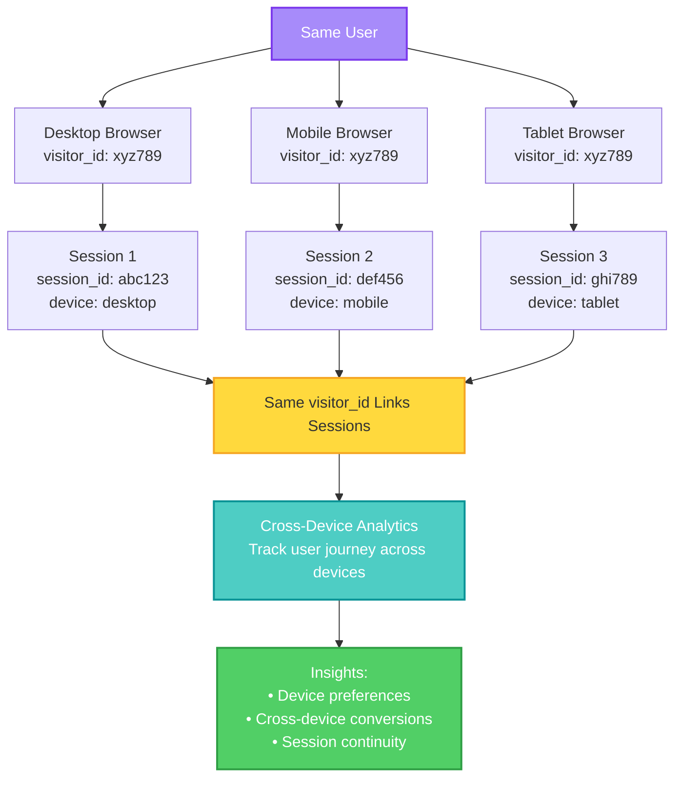

---

## 🎨 Legend

| Color     | Meaning            |
| --------- | ------------------ |
| 🔴 Red    | Redis operations   |
| 🔵 Cyan   | MongoDB operations |
| 🟡 Yellow | Cookie operations  |
| 🟢 Green  | Success states     |
| 🟣 Purple | Decision points    |
| 🔶 Orange | Error handling     |

---

## 📋 Key Takeaways

1. **Fast lookup**: Redis checked first (5ms), MongoDB fallback (50ms)
2. **Graceful degradation**: Errors don't block requests
3. **Journey preservation**: Same session_id from anonymous → customer → converted
4. **Async operations**: Events and metrics don't slow down responses
5. **Security first**: HttpOnly, Secure, SameSite cookies
6. **Cross-device tracking**: visitor_id links sessions across devices
7. **Complete attribution**: Track entire user journey for analytics

---

**Copy any of these Mermaid diagrams into your preferred Mermaid viewer or directly into GitHub/GitLab markdown files!**
